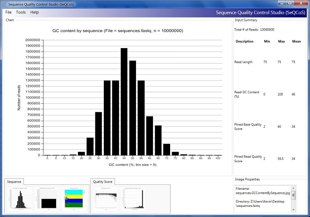

## Sequence Quality Control Studio (SeQCoS)

SeQCoS is an open source .NET software suite designed to perform quality control of massively parallel sequencing reads. 

## Project Description

* SeQCoS generates a series of standard plots to illustrate the quality of the input data. These plots (saved in JPEG file format) provide information on commonly observed measurements, such as GC content and distribution of quality scores at position-specific and sequence-specific levels.
* Basic trimming and discarding functions are provided to manipulate sequence files, according to:
	* Minimum read length; or
	* Minimum base quality score; or
	* Pattern matching by regular expression
* (Experimental) As an optional step, SeQCoS can invoke NCBI BLAST (standalone blast+ toolkit) to search the input against a BLAST-formatted database. A pre-formatted database of [NCBI UniVec](http://www.ncbi.nlm.nih.gov/VecScreen/UniVec.html), a repository of vector sequences, adapters, linkers and PCR primers that are used in DNA sequencing, is provided [here](https://github.com/kcha/seqcos/wiki/UniVecBlastDatabases); however, users are free to supply their own database for searching.

SeQCoS was written in C# using .NET 4.0 and integrates with [.NET Bio](https://github.com/dotnetbio/bio), an open-source bioinformatics library. Hence, this application takes advantage of functionality offered by .NET Bio for handling sequence data as well as [Sho](http://research.microsoft.com/en-us/projects/sho/), a data analysis and visualization application. The SeQCoS GUI was developed using Windows Presentation Foundation 4.0. 

### Formats Supported
Currently, the input and output formats supported by SeQCoS are limited to FASTA and FASTQ. For FASTA, only sequence-level analysis is performed.

## Documentation

Please visit the project [wiki](https://github.com/kcha/seqcos/wiki) page for more info.

## System requirements
 * Windows 7 or newer (older versions of Windows should work but has not been tested)
 * [Microsoft .NET 4.0](http://www.microsoft.com/net/)
 * [Sho 2.0.5](http://research.microsoft.com/en-us/projects/sho/) or higher (tested on 2.0.5)
 * 4 GB RAM or more
 * (optional) [Standalone blast+](http://www.ncbi.nlm.nih.gov/books/NBK52637/) (NCBI Blast for Windows) - for executing BLAST searches

## History of the project

The SeQCoS project was initiated by the Microsoft Biology Initiative group.
I started and developed the project while interning at Microsoft Research
(Redmond, WA) in the summer of 2011. Prior to being hosted on Github, the code was
originally hosted on Codeplex (https://archive.codeplex.com/?p=seqcos).
On November 2011, SeQCoS was featured in the [Microsoft Research Connections Blog](http://blogs.msdn.com/b/msr_er/archive/2011/11/09/building-a-net-quality-control-tool-for-next-generation-sequencing-technologies.aspx).

